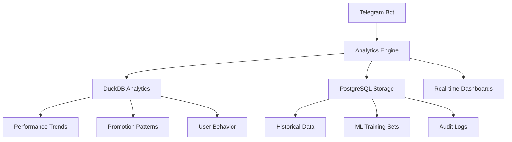
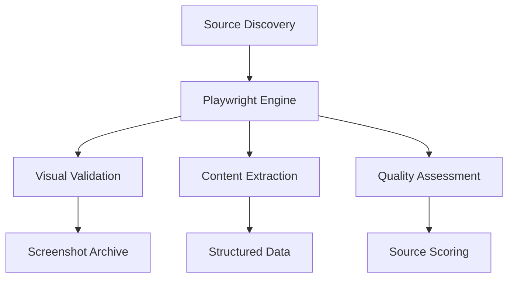
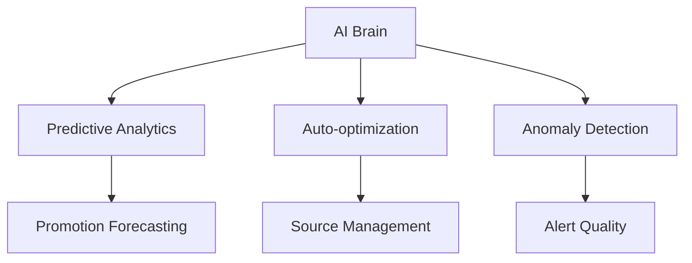

# 🏗️ Miles Bot Architecture Analysis & Enhancement Plan

## Current Architecture Overview

### **Core Components Analysis**

#### 1. **Telegram Interface Layer** ⭐ 9.5/10
- **ask_bot.py**: Main entry point with 15+ commands
- **Sophisticated command system**: `/ask`, `/chat`, `/brain`, `/sources`, `/config`
- **Rate limiting**: Advanced sliding window with burst capacity
- **Health monitoring**: Prometheus metrics + health server on :8080
- **Multimodal support**: Image analysis with GPT-4 Vision

#### 2. **Promotion Detection Engine** ⭐ 9.0/10
- **Multi-source scanning**: 13 Brazilian mileage sites + AI discovery
- **Plugin architecture**: Modular scrapers with independent scheduling
- **Smart deduplication**: Hash-based with Redis + file fallback
- **Real-time alerting**: Instant Telegram notifications for qualifying bonuses

#### 3. **OpenAI Integration** ⭐ 9.5/10
- **Advanced chat system**: Conversation memory with 30-minute TTL
- **AI Brain mode**: Autonomous bot control and optimization
- **User personalization**: Model, temperature, max tokens per user
- **Multimodal capabilities**: Image analysis with context integration

#### 4. **Data Storage & Persistence** ⭐ 8.0/10
- **Redis primary**: Chat history, preferences, promotion deduplication
- **File fallback**: Robust offline operation
- **PostgreSQL models**: Advanced schema with SQLAlchemy (not fully utilized)
- **Configuration**: YAML-based source management

#### 5. **Plugin System** ⭐ 9.0/10
- **Protocol-based**: Type-safe plugin contracts
- **Auto-discovery**: Entry points with environment control
- **Flexible scheduling**: Cron expressions + APScheduler integration
- **Error resilience**: Graceful failure handling

#### 6. **DevOps & Deployment** ⭐ 8.5/10
- **CI/CD pipeline**: GitHub Actions with security scanning
- **Containerization**: Docker with health checks
- **Cloud deployment**: Fly.io with auto-scaling
- **Monitoring**: Prometheus metrics + log streaming

## **New MCP-Enhanced Architecture Design**

### **Enhanced Capabilities Integration**

#### 1. **🗄️ Advanced Analytics Layer**


**New Components:**
- **miles/analytics_engine.py**: Real-time bot performance tracking
- **miles/promotion_analyzer.py**: ML-powered promotion pattern detection
- **miles/user_insights.py**: Advanced user behavior analytics

#### 2. **🎭 Web Intelligence System**


**New Components:**
- **miles/web_intelligence.py**: Automated source quality assessment
- **miles/visual_validator.py**: Screenshot-based promotion verification
- **miles/content_extractor.py**: Advanced web scraping with Playwright

#### 3. **🤖 AI-Powered Operations**


**New Components:**
- **miles/ai_operations.py**: Autonomous bot optimization
- **miles/prediction_engine.py**: ML-based promotion forecasting
- **miles/anomaly_detector.py**: Quality assurance and fraud detection

### **Integration Architecture**

#### **Unified Data Pipeline**
```python
# Enhanced workflow with MCP integration
def enhanced_promotion_workflow():
    # 1. Web Intelligence Scanning
    playwright_results = web_intelligence.scan_with_visual_validation()

    # 2. AI-Powered Analysis
    ai_scored_promotions = ai_operations.analyze_and_score(playwright_results)

    # 3. Advanced Storage
    duckdb_analytics.store_realtime_metrics(ai_scored_promotions)
    postgresql_storage.persist_historical_data(ai_scored_promotions)

    # 4. Intelligent Alerting
    alerts = prediction_engine.filter_high_value_promotions(ai_scored_promotions)

    # 5. User Delivery
    telegram_interface.deliver_personalized_alerts(alerts)

    # 6. Performance Tracking
    analytics_engine.record_workflow_metrics()
```

#### **New File Structure**
```
miles/
├── analytics/
│   ├── engine.py          # Real-time analytics
│   ├── duckdb_store.py    # DuckDB integration
│   ├── postgres_store.py  # PostgreSQL integration
│   └── dashboard.py       # Web dashboard
├── intelligence/
│   ├── web_scanner.py     # Playwright-powered scanning
│   ├── visual_validator.py # Screenshot validation
│   ├── quality_scorer.py  # AI-based quality assessment
│   └── source_discovery.py # Enhanced source finding
├── ai_operations/
│   ├── brain.py           # Enhanced AI brain
│   ├── predictor.py       # ML predictions
│   ├── optimizer.py       # Auto-optimization
│   └── anomaly.py         # Quality assurance
└── integrations/
    ├── mcp_manager.py     # MCP server coordination
    ├── playwright_client.py # Web automation
    ├── duckdb_client.py   # Analytics database
    └── postgres_client.py # Persistent storage
```

### **Performance Enhancements**

#### **1. Intelligent Caching Strategy**
- **L1 Cache**: In-memory for real-time operations
- **L2 Cache**: Redis for shared state
- **L3 Cache**: DuckDB for analytical queries
- **L4 Storage**: PostgreSQL for historical data

#### **2. Advanced Rate Limiting**
- **Adaptive limits**: ML-based user behavior adjustment
- **Priority queues**: High-value users get priority
- **Burst management**: Smart traffic shaping
- **Global coordination**: Cross-instance rate limiting

#### **3. Predictive Optimization**
- **Scan timing**: ML-optimized scheduling based on historical patterns
- **Source prioritization**: Dynamic quality-based ranking
- **Alert personalization**: User preference learning
- **Resource allocation**: Intelligent load balancing

### **New Capabilities Delivered**

#### **For Users:**
1. **Predictive Alerts**: AI forecasts best bonus timing
2. **Quality Scores**: Visual validation + source reliability
3. **Personal Insights**: Custom analytics dashboards
4. **Smart Scheduling**: Optimal scan times for each source

#### **For Operations:**
1. **Real-time Monitoring**: Live performance dashboards
2. **Automated Optimization**: Self-tuning bot parameters
3. **Anomaly Detection**: Fraud and error prevention
4. **Advanced Analytics**: Deep insights into promotion patterns

#### **For Development:**
1. **Visual Testing**: Automated screenshot validation
2. **Performance Profiling**: Database-backed metrics
3. **A/B Testing**: Configuration experimentation
4. **Predictive Scaling**: Resource optimization

### **Implementation Priority**

#### **Phase 1: Foundation** (Week 1)
- [ ] DuckDB analytics integration
- [ ] Enhanced PostgreSQL schema
- [ ] Basic Playwright web scanning
- [ ] MCP server coordination

#### **Phase 2: Intelligence** (Week 2)
- [ ] AI-powered quality scoring
- [ ] Visual validation system
- [ ] Predictive analytics engine
- [ ] Advanced source discovery

#### **Phase 3: Optimization** (Week 3)
- [ ] Auto-optimization system
- [ ] Anomaly detection
- [ ] Performance dashboards
- [ ] ML-based personalization

#### **Phase 4: Advanced Features** (Week 4)
- [ ] Predictive promotion forecasting
- [ ] Real-time quality monitoring
- [ ] Advanced user insights
- [ ] Cross-platform integration

## **Technical Implementation Details**

### **Database Schema Enhancement**
```sql
-- Enhanced promotion tracking
CREATE TABLE promotions_enhanced (
    id SERIAL PRIMARY KEY,
    -- Existing fields
    program VARCHAR(100),
    bonus_percentage INTEGER,
    source_url TEXT,
    -- New MCP-enhanced fields
    visual_hash VARCHAR(64),        -- Screenshot fingerprint
    quality_score DECIMAL(3,2),     -- AI-assessed quality
    prediction_confidence DECIMAL(3,2), -- ML confidence
    user_engagement_score DECIMAL(3,2), -- User interaction metrics
    extraction_method VARCHAR(50),   -- playwright, scraper, api
    validation_status VARCHAR(20),   -- verified, pending, failed
    created_with_mcp BOOLEAN DEFAULT TRUE
);

-- Performance analytics
CREATE TABLE bot_performance (
    id SERIAL PRIMARY KEY,
    timestamp TIMESTAMP DEFAULT NOW(),
    command VARCHAR(50),
    response_time_ms INTEGER,
    success BOOLEAN,
    user_id VARCHAR(50),
    source_quality_avg DECIMAL(3,2),
    mcp_server_used VARCHAR(50)
);
```

### **Enhanced Configuration Management**
```yaml
# Enhanced sources.yaml with MCP capabilities
sources:
  - url: "https://www.melhoresdestinos.com.br"
    priority: 1
    quality_threshold: 0.8
    mcp_enabled: true
    playwright_config:
      screenshot: true
      wait_for: ".promo-content"
      validation_selectors:
        - ".bonus-percentage"
        - ".program-name"
    ai_scoring:
      enabled: true
      confidence_threshold: 0.7
```

This enhanced architecture transforms Miles from an excellent promotion alerting bot into a **comprehensive mileage intelligence platform** with predictive capabilities, advanced analytics, and autonomous optimization.
