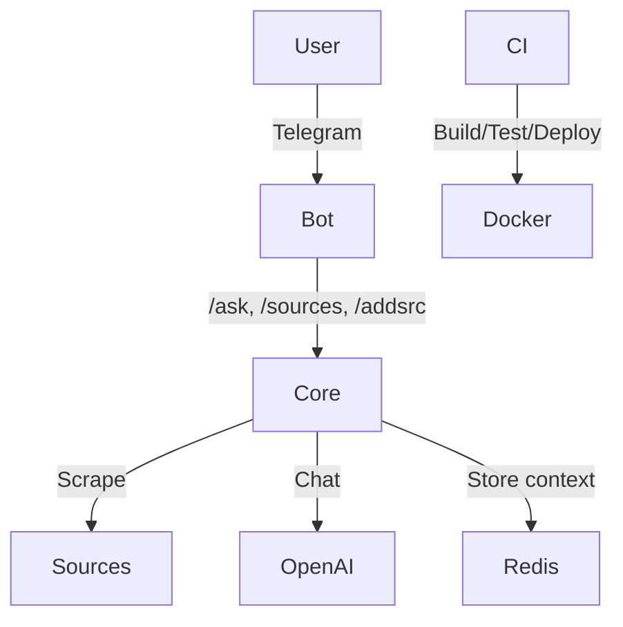

# Miles - Telegram Bonus Alert Bot

This bot checks several mileage blogs for transfer bonus promotions and sends
Telegram notifications when new deals appear.

Environment variables:

- `TELEGRAM_BOT_TOKEN` – bot token used to send messages (required)
- `TELEGRAM_CHAT_ID` – default chat to notify (required)
- `MIN_BONUS` – minimum bonus percentage to alert (default 80)
- `SOURCES_PATH` – path to the YAML file with program sources
- `OPENAI_API_KEY` – required for the `/chat` command and AI features
- `REDIS_URL` – Redis connection for chat history and preferences (falls back to file storage)
- `LOG_WEBHOOK_URL` – webhook URL for CI log streaming (optional)

## Quick start

1. Configure the secrets `TELEGRAM_BOT_TOKEN`, `TELEGRAM_CHAT_ID`, `MIN_BONUS`,
   `FLY_API_TOKEN`, `OPENAI_API_KEY` and optionally `SOURCES_PATH` in your GitHub repository.

2. Create the Fly.io app (run once):

   ```bash
   flyctl apps create miles
   ```
3. Deploy to Fly.io with a single command:

   ```bash
   gh workflow run deploy-fly
   ```

To run everything locally:

```bash
docker compose up
```

**Note**: For `/chat` command to work, you need to set the `OPENAI_API_KEY` environment variable or Fly.io secret.

After cloning the repository, install the development extras and run the checks:

```bash
pip install -e .[dev]
pre-commit run --all-files
```

Edit `sources.yaml` to change which pages are scanned.

### Runtime commands

| Command | Action |
|---------|--------|
| `/ask` | Run an immediate promotion scan |
| `/sources` | List current sources |
| `/addsrc <url>` | Add a new source URL |
| `/rmsrc <id_or_url>` | Remove a source by index or full URL |
| `/update` | AI-powered search for new sources |
| `/chat <text>` | Talk with the integrated AI assistant |
| `/brain <command>` | Let AI control and optimize the bot |
| `/config` | Show current configuration and available commands |
| `/setmodel <model>` | Change AI model (gpt-4o-mini, gpt-4o, etc.) |
| `/settemp <0.0-2.0>` | Set AI response temperature |
| `/setmaxtokens <100-4000>` | Set maximum response length |
| `/import <urls>` | Import sources from URLs in text |
| `/export` | Export all sources as text |
| `/schedule` | View current scan/update schedule |
| `/setscantime <hours>` | Set promotion scan times (e.g., 8,20) |
| `/setupdatetime <hour>` | Set source update time (e.g., 7) |
| `/end` | Clear chat context |
| `/debug` | Show bot status and diagnostics |

## AI Brain Commands

The `/brain` command gives AI autonomous control over the bot:

| Brain Command | Action |
|---------------|--------|
| `/brain analyze` | AI analyzes bot performance and suggests improvements |
| `/brain discover` | AI intelligently discovers new mileage sources |
| `/brain scan` | AI runs and analyzes promotion scans |
| `/brain optimize` | AI optimizes settings and configuration |
| `/brain <question>` | Ask AI to control any aspect of the bot |

## ChatGPT mode

Use `/chat <message>` to converse with the bot. The conversation is kept per
Telegram user in Redis for up to 30 minutes. Send `/end` to clear the stored
context. Set `OPENAI_API_KEY` to enable this feature.

**Multimodal Support**: Send images to the bot for AI analysis! The bot can analyze screenshots, documents, or any visual content you send via Telegram. Add a caption to provide context for the image analysis.

**Personalization**: Configure your AI experience with `/setmodel`, `/settemp`, and `/setmaxtokens` commands. Each user's preferences are stored individually.

## Example sources

- **Melhores Destinos**<br>
  Portal brasileiro que publica diariamente promoções de bônus de transferência (Livelo, Esfera, Iupp etc.) e envia alertas imediatos via app, push, Telegram e newsletter.
  > "Se tem promoção de transferência bonificada na área, tem condição boa para comprar milhas mais baratas..."<br>
  Fonte: <https://www.melhoresdestinos.com.br/milhas/pontos-dinheiro-bonus-livelo-smiles-maio25>

- **Passageiro de Primeira**<br>
  Blog especializado em programas de fidelidade; divulga transferências bonificadas em tempo real, traz análises detalhadas e oferece grupos de Telegram, WhatsApp e notificações por aplicativo.
  > "Relembramos as melhores promoções de transferências bonificadas de pontos que ocorreram em 2024"<br>
  Fonte: <https://passageirodeprimeira.com/retrospectiva-promocoes-de-transferencias-bonificadas-2024/>

- **Pontos pra Voar**<br>
  Site que cobre promoções de milhas, cartões e hotéis; publica tabelas comparativas de bônus de transferência e avisa assinantes por newsletter, Telegram ou feed RSS.
  > "Receba até 80% de bônus na transferência de pontos do Itaú para o Azul Fidelidade"<br>
  Fonte: <https://pontospravoar.com/receba-ate-80-porcento-bonus-transferencia-pontos-itau-azul-fidelidade/>

- **Mestre das Milhas**<br>
  Portal focado em maximizar milhas; posta rapidamente campanhas de bônus de transferência, calcula custos e mantém canal no Telegram para alertas instantâneos.
  > "Livelo oferece até 110% de bônus na transferência de pontos para a Smiles"<br>
  Fonte: <https://mestredasmilhas.com/livelo-oferece-ate-110-de-bonus-na-transferencia-de-pontos-para-a-smiles/>

- **Guia do Milheiro**<br>
  Agregador brasileiro que reúne promoções de transferência bonificada, explica regras, mostra passo a passo e envia avisos por newsletter ou Telegram.
  > "Azul Fidelidade oferece até 80% de bônus na transferência de pontos – veja como participar"<br>
  Fonte: <https://guiadomilheiro.com.br/azul-fidelidade-oferece-ate-80-de-bonus-na-transferencia-de-pontos-veja-como-participar/>

## Architecture



## Log Streaming

The CI pipeline can forward step logs to a webhook for real-time monitoring and offline analysis.

### Start the log receiver locally

```bash
python log_receiver.py
```

In another terminal, expose it publicly with ngrok:

```bash
ngrok http 5051
```

Copy the HTTPS URL (e.g., `https://abc123.ngrok.io`) and set it as the `LOG_WEBHOOK_URL` secret in your GitHub repository settings.

### Webhook payload format

The receiver expects JSON payloads with:
```json
{
  "run_id": "github-run-id-or-local-test",
  "step": "pytest|mypy|ping",
  "log": "full step output as string"
}
```

### Log storage

All received logs are stored in `received_logs/<run_id>.ndjson` for offline analysis. Each line contains a complete JSON payload.

### Test connectivity

```bash
./scripts/ping_webhook.sh http://localhost:5051
# or with your ngrok URL:
./scripts/ping_webhook.sh https://abc123.ngrok.io
```

### Rotate webhook URL

When your ngrok URL changes, update the `LOG_WEBHOOK_URL` secret in GitHub repository settings → Secrets and variables → Actions.

## Troubleshooting

### Chat command not working

If you get "❌ Chat feature is not available. OpenAI API key not configured":

1. **Local development**: Set environment variable
   ```bash
   export OPENAI_API_KEY="your-api-key-here"
   ```

2. **Fly.io deployment**: Set secret and redeploy
   ```bash
   fly secrets set OPENAI_API_KEY="your-api-key-here"
   fly deploy
   ```

3. **Verify deployment**: Check logs
   ```bash
   fly logs
   ```
   Look for: `[ask_bot] OpenAI client initialized`

## Development

Run the checks before committing:

```bash
pytest -q
mypy --strict miles/
```
