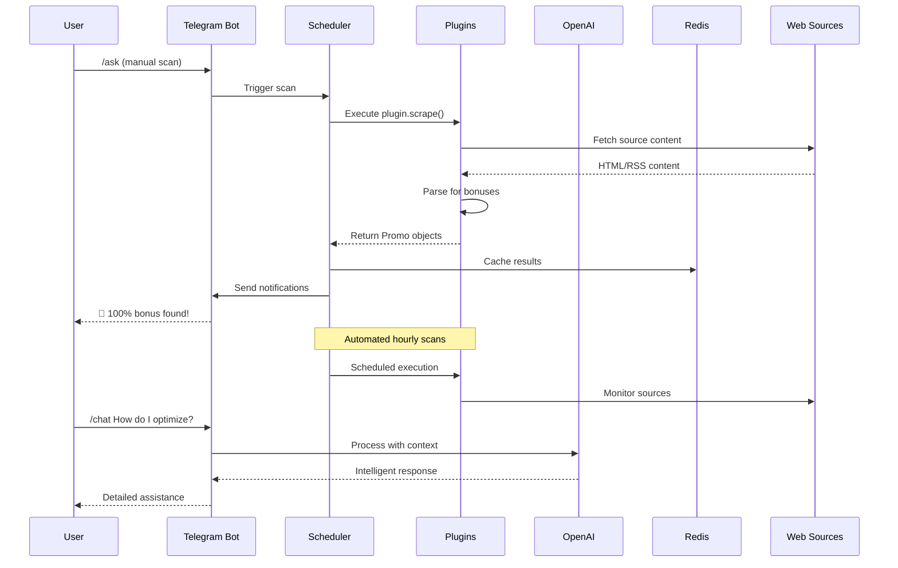
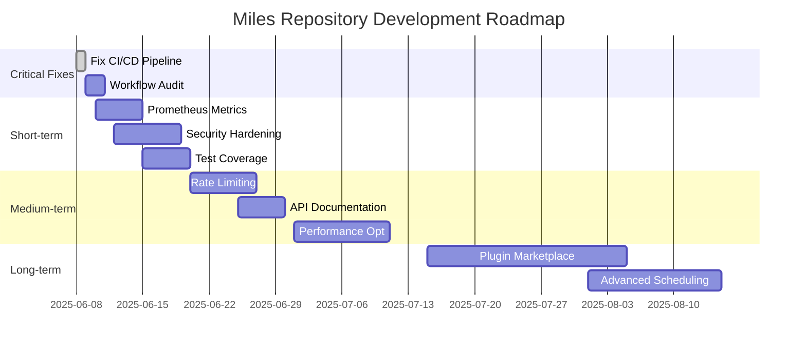

# Miles Repository Architecture Diagrams

## System Architecture Overview

```mermaid
graph TB
    %% Entry Points
    subgraph "Entry Points"
        ask_bot["ask_bot.py<br/>Main Bot Interface"]
        bonus_alert["bonus_alert_bot.py<br/>Delegator"]
        log_receiver["log_receiver.py<br/>CI Log Webhook"]
    end

    %% Core Infrastructure
    subgraph "Core Miles Package"
        miles_bonus["miles/bonus_alert_bot.py<br/>Core Bot Logic"]
        plugin_api["miles/plugin_api.py<br/>Plugin Contract"]
        plugin_loader["miles/plugin_loader.py<br/>Plugin Discovery"]
        scheduler["miles/scheduler.py<br/>APScheduler Manager"]
        source_store["miles/source_store.py<br/>Source Management"]
        chat_store["miles/chat_store.py<br/>Chat Memory"]
    end

    %% Configuration & Storage
    subgraph "Configuration"
        config["config.py<br/>Settings"]
        sources_yaml["sources.yaml<br/>Source URLs"]
        pyproject["pyproject.toml<br/>Dependencies & Plugins"]
    end

    %% Plugin System
    subgraph "Plugin Ecosystem"
        demo_plugin["plugins/demo_hello/<br/>Demo Plugin"]
        other_plugins["plugins/*/<br/>Extensible Plugins"]
        plugin_entries["Entry Points<br/>Dynamic Discovery"]
    end

    %% External Services
    subgraph "External Services"
        telegram["Telegram API<br/>Bot Interface"]
        openai["OpenAI API<br/>Chat & AI Features"]
        redis["Redis<br/>Cache & State"]
        sources["Web Sources<br/>Mileage Sites"]
    end

    %% CI/CD Pipeline
    subgraph "CI/CD"
        github_ci[".github/workflows/<br/>CI Pipeline"]
        docker["Dockerfile<br/>Containerization"]
        fly_deploy["Fly.io<br/>Deployment"]
    end

    %% Data Flow Connections
    ask_bot --> miles_bonus
    bonus_alert --> miles_bonus

    miles_bonus --> scheduler
    miles_bonus --> source_store
    miles_bonus --> chat_store
    miles_bonus --> telegram
    miles_bonus --> openai

    scheduler --> plugin_loader
    plugin_loader --> plugin_api
    plugin_loader --> demo_plugin
    plugin_loader --> other_plugins

    source_store --> sources_yaml
    source_store --> redis
    chat_store --> redis

    config --> miles_bonus
    pyproject --> plugin_entries
    plugin_entries --> plugin_loader

    github_ci --> docker
    docker --> fly_deploy
    log_receiver --> github_ci

    miles_bonus --> sources
    scheduler --> sources

    %% Styling
    classDef entryPoint fill:#e1f5fe
    classDef core fill:#f3e5f5
    classDef config fill:#fff3e0
    classDef plugin fill:#e8f5e8
    classDef external fill:#ffebee
    classDef cicd fill:#f1f8e9

    class ask_bot,bonus_alert,log_receiver entryPoint
    class miles_bonus,plugin_api,plugin_loader,scheduler,source_store,chat_store core
    class config,sources_yaml,pyproject config
    class demo_plugin,other_plugins,plugin_entries plugin
    class telegram,openai,redis,sources external
    class github_ci,docker,fly_deploy cicd
```

## Data Flow Sequence

```mermaid
sequenceDiagram
    participant U as User
    participant T as Telegram Bot
    participant S as Scheduler
    participant P as Plugins
    participant AI as OpenAI
    participant R as Redis
    participant W as Web Sources

    U->>T: /ask (manual scan)
    T->>S: Trigger scan
    S->>P: Execute plugin.scrape()
    P->>W: Fetch source content
    W-->>P: HTML/RSS content
    P->>P: Parse for bonuses
    P-->>S: Return Promo objects
    S->>R: Cache results
    S->>T: Send notifications
    T-->>U: 🎯 100% bonus found!

    Note over S,P: Automated hourly scans
    S->>P: Scheduled execution
    P->>W: Monitor sources

    U->>T: /chat How do I optimize?
    T->>AI: Process with context
    AI-->>T: Intelligent response
    T-->>U: Detailed assistance
```

## Development Roadmap Timeline

```mermaid
gantt
    title Miles Repository Development Roadmap
    dateFormat  YYYY-MM-DD
    section Critical Fixes
    Fix CI/CD Pipeline       :done, fix-ci, 2025-06-08, 1d
    Workflow Audit          :audit, after fix-ci, 2d

    section Short-term
    Prometheus Metrics      :metrics, 2025-06-10, 5d
    Security Hardening      :security, 2025-06-12, 7d
    Test Coverage          :tests, 2025-06-15, 5d

    section Medium-term
    Rate Limiting          :rate, 2025-06-20, 7d
    API Documentation      :docs, 2025-06-25, 5d
    Performance Opt        :perf, 2025-07-01, 10d

    section Long-term
    Plugin Marketplace     :marketplace, 2025-07-15, 21d
    Advanced Scheduling    :sched, 2025-08-01, 14d
```
